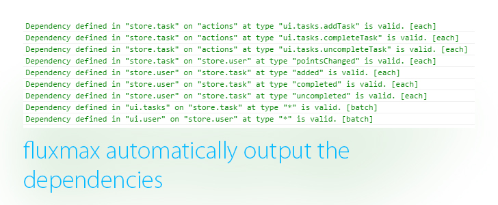

# Readme example

An example using fluxmax and smart-css.

## Setup

Install gulp globally `npm install -g gulp`.
Then follow one of the paths (with npm or with git clone) below.

### With npm

Install with this command `npm install fluxmax-smart-css`. It will install in the `node_modules` folder. 

### With git clone

First clone this project, then cd into it and run: `npm install`

## Run

Cd into the `fluxmax-smart-css` folder (with npm this will be `node_modules/fluxmax-smart-css`).

Run it with gulp:

    gulp

Go to: [http://localhost:8080/](http://localhost:8080/) (yes, you canclick on this)

**What to do now?**

 - Click on add task to add tasks;
 - Insert the threshold of points for that task to auto complete;
 - Notice the task is not yet done and the number of points it has (at bottom);
 - Click on a not complete task to complete;
 - Click on a complete task to make it non complete;
 - Watch the user's points grow;
 - Watch how the tasks gets auto completed when the threshold is hit;
 - Open up the console and check how exactly the app communicates internally;

## What it does

**Rules:**
 - When a task is added the user gets 1 point;
 - When a task is done manually or automatically the user gets a random number of points;
 - Each task has a threshold which defines the minimum of points the user needs to have to complete automatically; When this threshold is reached the task auto completes.
 - When a task passes from completed to not complete the user lose the points;

**Flow:**
 - User adds a new task which auto completes when the user has 2 points;
 - On adding a task the user receives 1 point;
 - User adds another task which adds 1 point and auto completes when the user has 5 points.
   - Now the user has a total of 2 points;
   - The first task is done.
   - When the first task is done the user receives 10 points;
   - This will also complete the 2nd task because the user now has 12 points;

## How it does

In this example we will use these stores:

 - User;
 - Task;

When a new task is added the user gain 1 point, when is done gains a random number of points.

### Dependencies

Fluxmax makes very easy to see how your app is wired internally, just open the console and you will see all the dependencies:

> Dependency defined in "store.task" on "actions" at type "ui.tasks.addTask" is valid. [each]

The first line says the `task` store listens on the entity `actions` on the event `ui.tasks.addTask`. The entity `actions` is used from the view/UI part of the app. The `[each]` part at the end tells that is listening on the `each phase`.

> Dependency defined in "ui.user" on "store.user" at type "*" is valid. [batch]

The last line says the the `ui.user` entity, which is the view of the user which contains the points, listens on `*` events (this means that listen to all the events) on the `user` store. Notice that at the end now says `[batch]`, this means that the view is listening on the `batch phase`.

### Task store

The task store dispatches the events `added` and `done`. All the events will be dispatched
from the store, which has an entity id equal to `store.task`.

### User store

The user store listens to the events `added` and `done` from the entity `store.task`.
This store will also dispatch the event `pointsChanged`.

## UI (User Interface)

There are 2 views, one which contains the user's points and another which contains the tasks.

### User UI

The user UI will listen to the events `pointsChanged` on the entity `store.user`.

### Tasks UI

The tasks UI will listen to the events `added` and `done` on the entity `store.task`.
